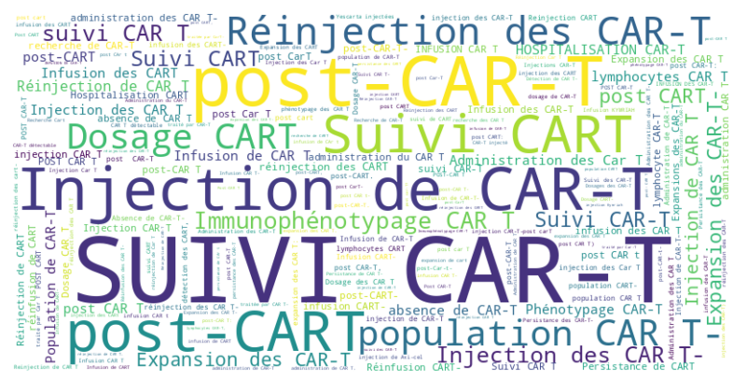
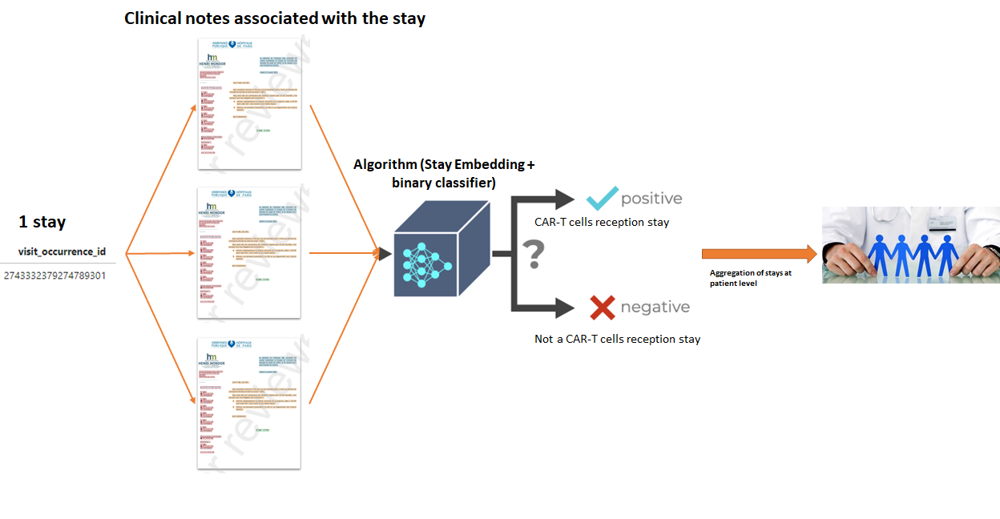

# Classification of phenotypes after CAR-T cell injection

Recently, patients with advanced hematological malignancies, such as relapsed or refractory acute leukemia, lymphoma or multiple myeloma, have become eligible for CAR-T cells. 
Leukemia, lymphoma or multiple myeloma, whether relapsed or refractory, are eligible for CAR-T cells, an innovative therapy that has revolutionized the treatment of these patients. AP-HP was the first site in France to apply this therapy. Initially available at two sites, this treatment complex to implement, is now available at six sites in our institution. We have investigated the differences in management strategies for patients receiving CART cells, looking in particular at the clinico-biological phenotypic profiles of these stays.

The first stake of this project was the identification of CAR-T cells therapy receivers. 
The mere textual mention of CAR-T cells in a medical report in no way guarantees that the therapy has been received.

An algorithm was developed to detect patients receiving the therapy on the basis of their reports.
Based on medical knowledge and using the EDS-NLP library (https://aphp.github.io/edsnlp/) made available by the I&D division's Data Science team, an 18-variable representation was established for each stay based on its associated reports. A classification model was then trained to determine whether a stay corresponded to a therapy reception based on its associated notes. 
We used patients with a CCAM procedure code to constitute the training dataset  for our decision algorithm. We then aggregated the results of the stays to obtain patient numbers. The method is illustrated graphically below.

